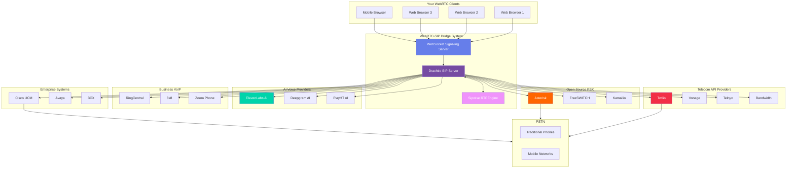

```mermaid
graph TB
    subgraph "Your WebRTC Clients"
        WEB1[Web Browser 1]
        WEB2[Web Browser 2]
        WEB3[Web Browser 3]
        MOBILE[Mobile Browser]
    end
    
    subgraph "WebRTC-SIP Bridge System"
        WS[WebSocket Signaling Server]
        DRACHTIO[Drachtio SIP Server]
        RTP[Sipwise RTPEngine]
        
        WS --> DRACHTIO
        DRACHTIO <--> RTP
    end
    
    subgraph "AI Voice Providers"
        ELEVEN[ElevenLabs AI]
        DEEP[Deepgram AI]
        PLAY[PlayHT AI]
    end
    
    subgraph "Telecom API Providers"
        TWILIO[Twilio]
        VONAGE[Vonage]
        TELNYX[Telnyx]
        BANDWIDTH[Bandwidth]
    end
    
    subgraph "Business VoIP"
        RING[RingCentral]
        EIGHT[8x8]
        ZOOM[Zoom Phone]
    end
    
    subgraph "Open Source PBX"
        ASTERISK[Asterisk]
        FREESWITCH[FreeSWITCH]
        KAMAILIO[Kamailio]
    end
    
    subgraph "Enterprise Systems"
        CISCO[Cisco UCM]
        AVAYA[Avaya]
        TCX[3CX]
    end
    
    subgraph "PSTN"
        PHONE[Traditional Phones]
        MOBILE_NET[Mobile Networks]
    end
    
    WEB1 --> WS
    WEB2 --> WS
    WEB3 --> WS
    MOBILE --> WS
    
    DRACHTIO --> ELEVEN
    DRACHTIO --> DEEP
    DRACHTIO --> PLAY
    
    DRACHTIO --> TWILIO
    DRACHTIO --> VONAGE
    DRACHTIO --> TELNYX
    DRACHTIO --> BANDWIDTH
    
    DRACHTIO --> RING
    DRACHTIO --> EIGHT
    DRACHTIO --> ZOOM
    
    DRACHTIO --> ASTERISK
    DRACHTIO --> FREESWITCH
    DRACHTIO --> KAMAILIO
    
    DRACHTIO --> CISCO
    DRACHTIO --> AVAYA
    DRACHTIO --> TCX
    
    TWILIO --> PSTN
    ASTERISK --> PSTN
    CISCO --> PSTN
    
    style WS fill:#667eea,color:#fff
    style DRACHTIO fill:#764ba2,color:#fff
    style RTP fill:#f093fb,color:#fff
    style ELEVEN fill:#00d4aa,color:#fff
    style TWILIO fill:#f22f46,color:#fff
    style ASTERISK fill:#ff6600,color:#fff
```